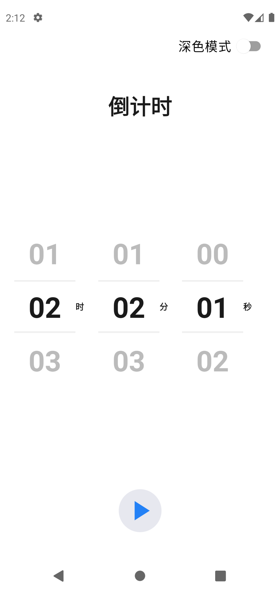
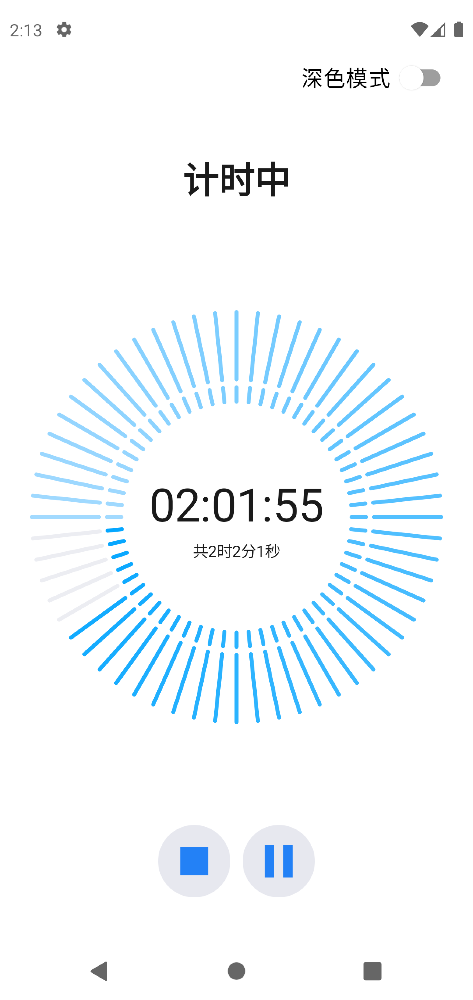
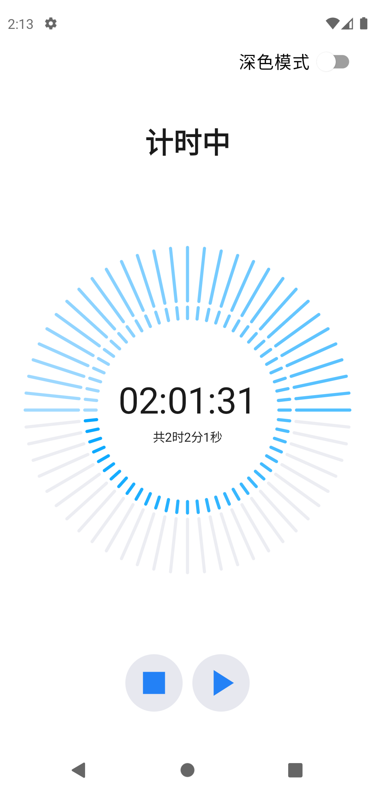
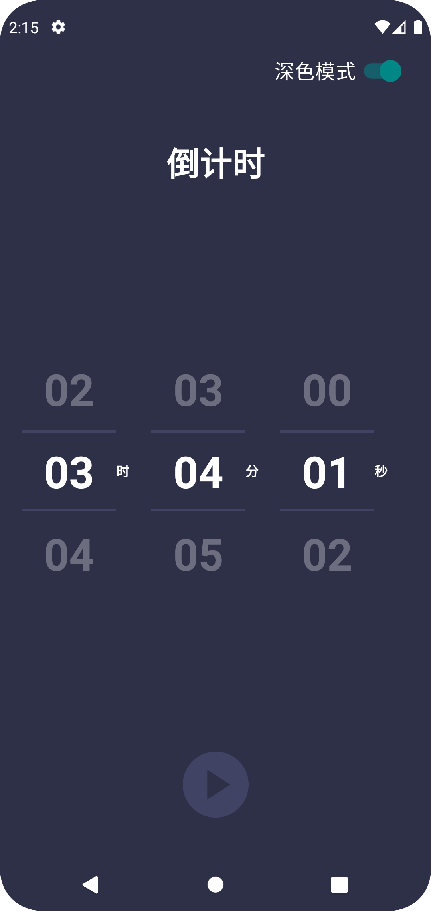
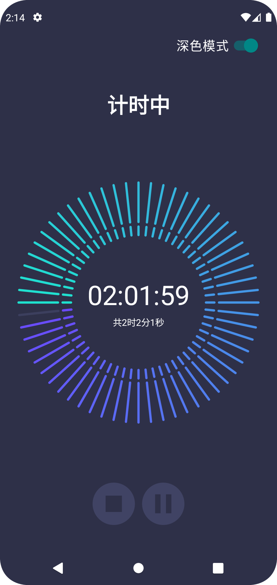
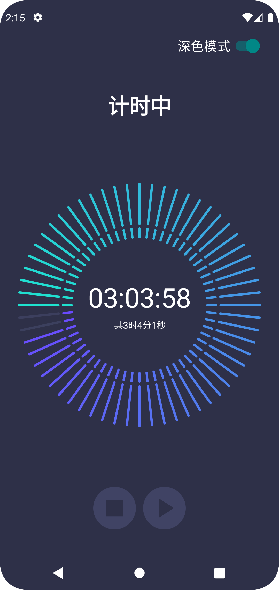
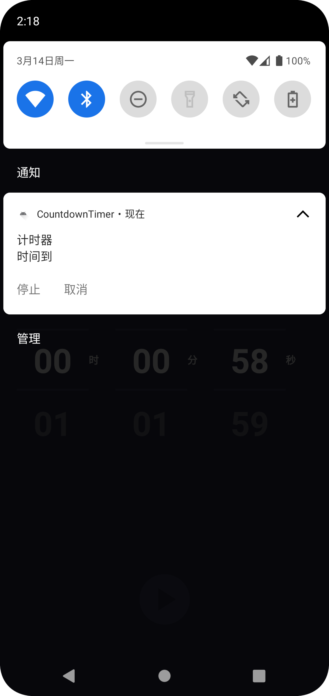

# CountdownTimer
使用 jetpack compose 实现的倒计时APP
* 选择时间
* 倒计时
* 倒计时完成进行系统通知并响铃

# 截图
可以通过页面深色模式按钮切换深色与浅色模式

## 浅色模式

* 选择时间页面

* 倒计时页面

* 倒计时暂停

## 深色模式

* 选择时间页面

  
* 倒计时页面

* 倒计时暂停

## 计时结束，系统通知 

